<div align="center">

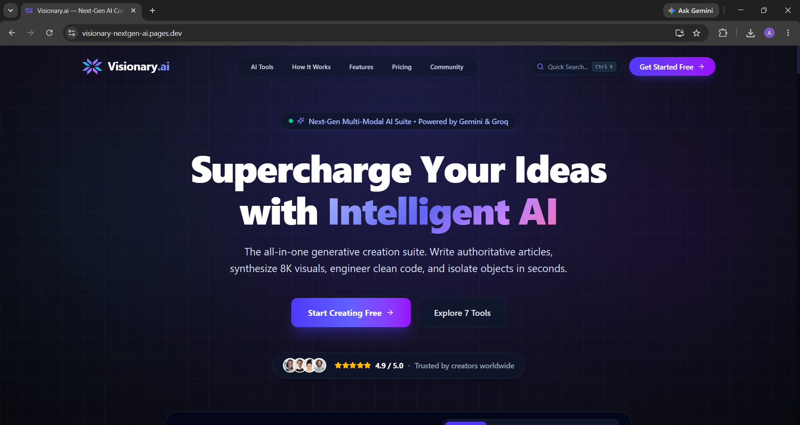

<br/>

<a href="https://visionary-nextgen-ai.pages.dev/"></a>
<a href="https://github.com/Aniket-Meshram-dev/Visionary-AI/stargazers"></a>
<a href="./LICENSE"></a>
<a href="https://github.com/Aniket-Meshram-dev/Visionary-AI/issues"></a>

<br/><br/>

> An enterprise-grade, full-stack AI platform unifying high-velocity generative text streaming, 4K visual synthesis, neural photo inpainting, interactive ATS resume engineering, and multi-currency billing into a single cohesive creative & career ecosystem.

<br/>


<br/>

**[🌐 Live App](https://visionary-nextgen-ai.pages.dev/) · [✨ Features](#-key-features) · [🏗️ Architecture](#️-system-architecture) · [📡 API Docs](#-api-documentation) · [🚀 Setup](#-installation--local-setup) · [🐛 Report Bug](https://github.com/Aniket-Meshram-dev/Visionary-AI/issues)**

</div>

---

## 🌐 Live Demo

<div align="center">

### 🔗 [**visionary-nextgen-ai.pages.dev**](https://visionary-nextgen-ai.pages.dev/)

*Deployed on Cloudflare Pages (frontend) with an auto-scaling Render API backend.*

</div>

> [!TIP]
> Spin up the **Free Plan** instantly with 10 generations across every tool — no credit card required. Explore the AI Article Writer or the 4K Image Studio first for the fastest "wow" moment.

---

## 📸 Product Walkthrough

<div align="center">

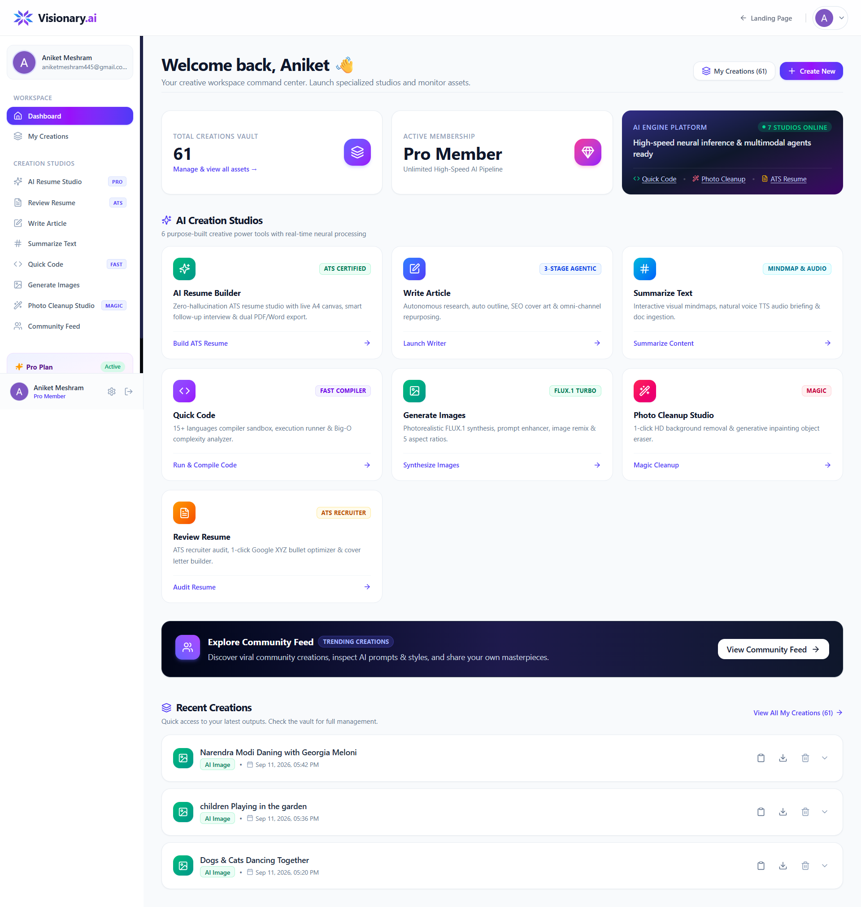

<sub><b>Figure 1 —</b> Multi-Tool Command Center with live usage telemetry and quick tool launcher</sub>

<br/><br/>

<table>
<tr>
<td width="50%" align="center">
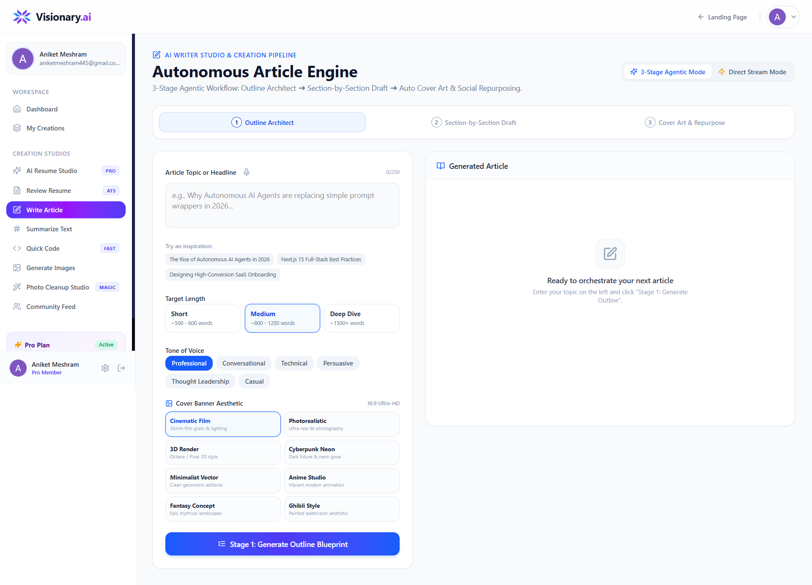
<sub><b>Real-Time SSE Article Writer</b><br/>Streaming Markdown + outline staging + repurposing</sub>
</td>
<td width="50%" align="center">
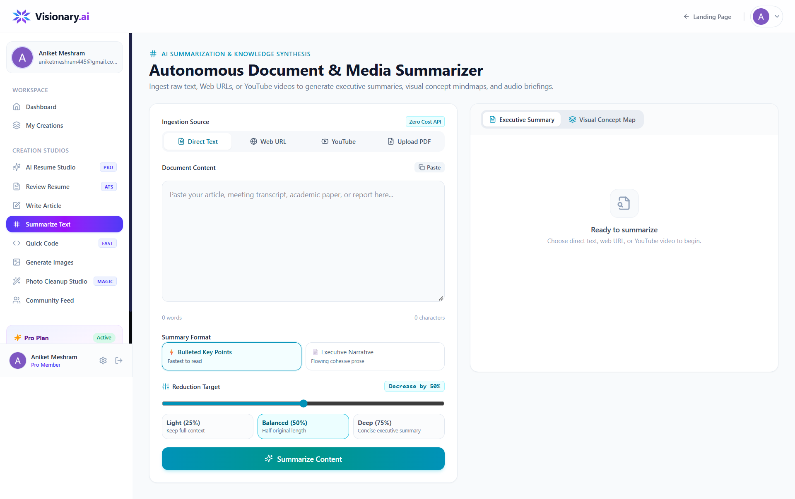
<sub><b>Summarizer + Mindmap</b><br/>Web/YouTube ingestion with Mermaid.js concept maps</sub>
</td>
</tr>
<tr>
<td width="50%" align="center">
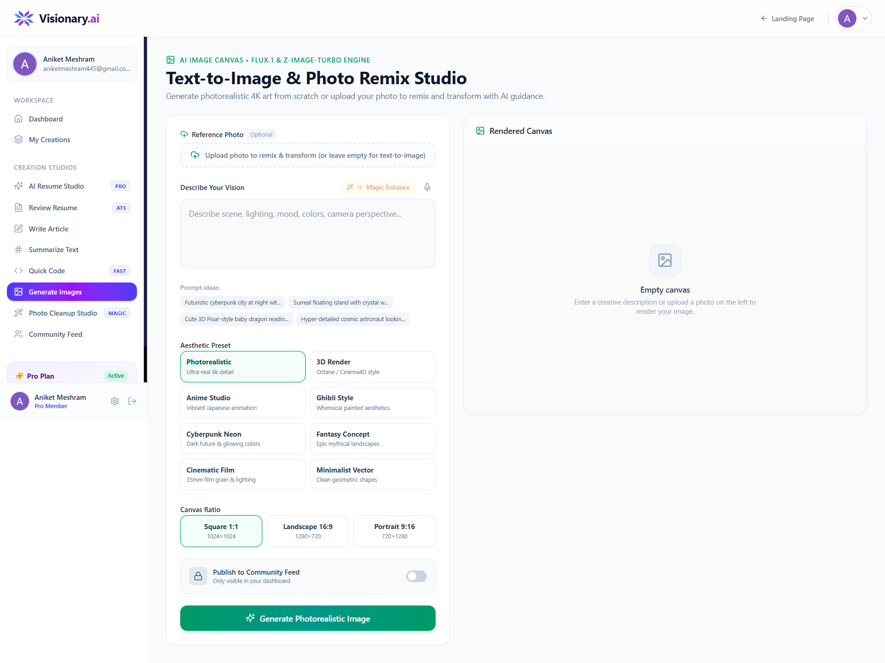
<sub><b>4K Image Generation Studio</b><br/>Style-aware prompt enrichment + Cloudinary CDN</sub>
</td>
<td width="50%" align="center">
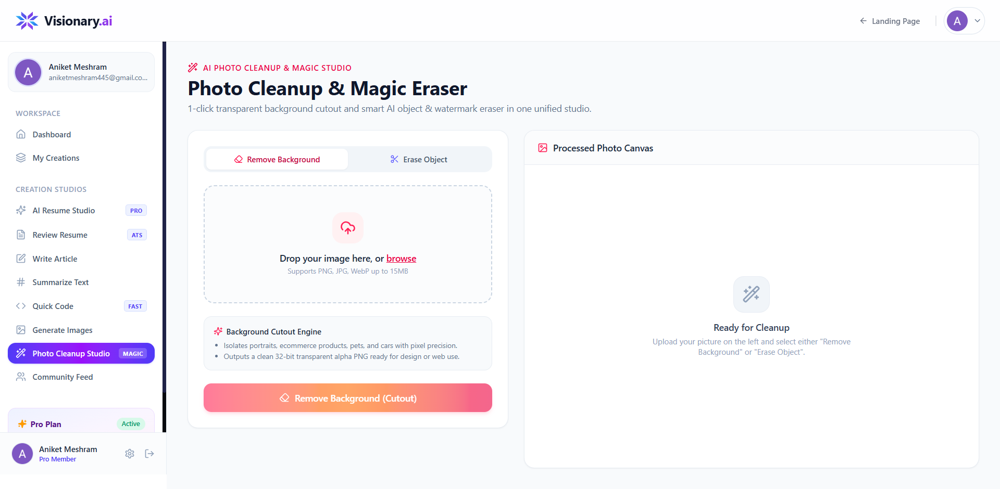
<sub><b>Photo Cleanup & Inpainting</b><br/>Neural background removal + generative object removal</sub>
</td>
</tr>
<tr>
<td width="50%" align="center">
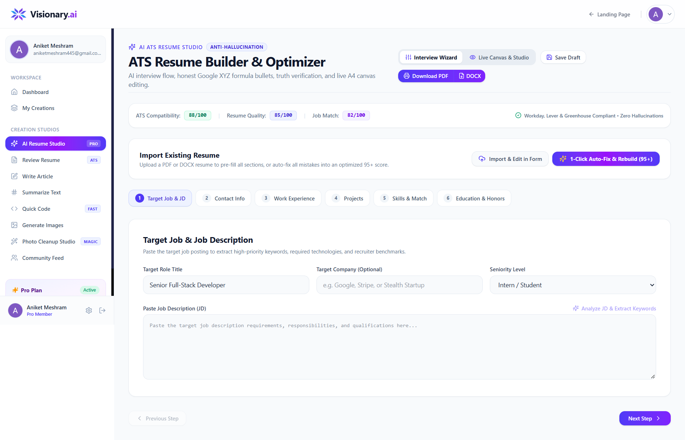
<sub><b>Interactive ATS Resume Builder</b><br/>Live A4 canvas + interview probing + PDF/DOCX export</sub>
</td>
<td width="50%" align="center">
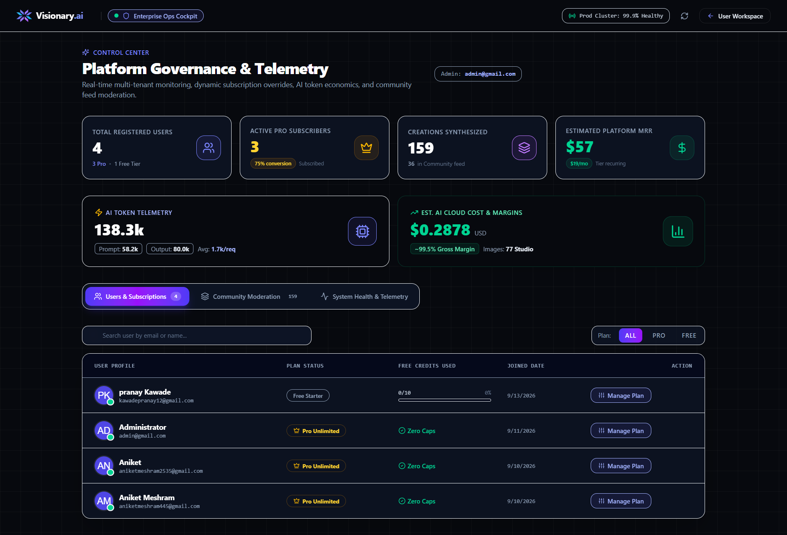
<sub><b>Admin Control Center</b><br/>MRR tracking, token telemetry, user & content moderation</sub>
</td>
</tr>
</table>

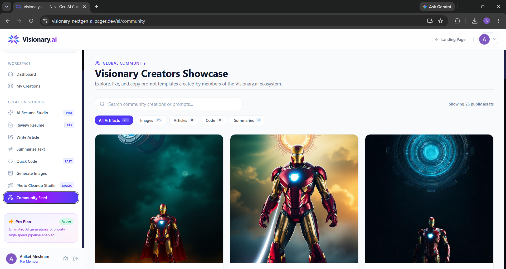
<sub><b>Figure 8 —</b> Public Community Feed with social favoriting and deep-linkable share pages</sub>

</div>

---

## 📑 Table of Contents

<details>
<summary><b>Click to expand full navigation</b></summary>

- [Why I Built This](#-why-i-built-this)
- [Key Features](#-key-features)
- [System Architecture](#️-system-architecture)
- [Full Tech Stack](#-full-tech-stack)
- [Project Directory Structure](#-project-directory-structure)
- [Database Schema & Storage Architecture](#️-database-schema--storage-architecture)
- [API Documentation](#-api-documentation)
- [Environment Variables](#-environment-variables)
- [Installation & Local Setup](#-installation--local-setup)
- [Deployment Guide](#-deployment-guide)
- [Security & Access Control](#️-security--access-control)
- [Challenges Faced & Engineering Learnings](#-challenges-faced--engineering-learnings)
- [Future Improvements & Roadmap](#-future-improvements--roadmap)
- [Author & Contact](#-author--contact)
- [License](#-license)

</details>

---

## 💡 Why I Built This

Modern creators, engineers, and job seekers juggle a fragmented stack of subscriptions — one tool for writing, another for images, another for photo cleanup, another for resume tailoring. **Visionary.ai** unifies these mission-critical creative and career workflows into a single high-performance platform, powered by lightning-fast Groq LPU inference, Supabase auth, and Cloudinary media delivery — with automatic fallbacks so nothing ever hard-fails on quota limits.

---

## ✨ Key Features

<table>
<tr><th width="4%">#</th><th width="35%">Feature</th><th>What it does</th></tr>

<tr><td align="center">1️⃣</td><td><b>Real-Time Article Writer</b><br/><sub>Groq LPU + SSE</sub></td><td>Structured outline → live SSE streaming Markdown → auto 16:9 cover art → 1-click repurposing into Twitter threads, LinkedIn posts & newsletters, plus an inline copilot toolbar (shorten / analogy / persuasive / Hindi / expand).</td></tr>

<tr><td align="center">2️⃣</td><td><b>Multi-Source Summarizer & Mindmap</b><br/><sub>Cheerio · YouTube · pdf-parse</sub></td><td>Ingests URLs (SSRF-protected), YouTube transcripts, or documents (PDF/TXT/MD/CSV/JSON up to 10MB); compresses by 1–99%; renders Mermaid.js concept mindmaps; grounded Q&A drawer; multilingual audio briefing (EN/HI auto-detect).</td></tr>

<tr><td align="center">3️⃣</td><td><b>Polyglot QuickCode Generator</b><br/><sub>Groq Compound</sub></td><td>Production-ready code in JS, TS, Python, Java, C++, Go, Rust, SQL with automatic Big-O complexity headers, plus a sandboxed execution simulator (stdin, exit codes, runtime, stderr).</td></tr>

<tr><td align="center">4️⃣</td><td><b>4K AI Image Studio</b><br/><sub>Pollinations Multi-Model Gateway</sub></td><td>1:1 / 16:9 / 9:16 outputs across 8 curated styles, prompt-intelligence enhancer, negative-prompt injection, image-to-image remixing, zero-watermark Cloudinary delivery.</td></tr>

<tr><td align="center">5️⃣</td><td><b>Photo Cleanup & Object Removal</b><br/><sub>Cloudinary Generative AI</sub></td><td>Transparent-PNG background stripping with clean edge detection, targeted generative inpainting for any named object, and an interactive before/after comparison slider.</td></tr>

<tr><td align="center">6️⃣</td><td><b>ATS Resume Auditor</b><br/><sub>Gemini OCR fallback + Groq</sub></td><td>Dual-engine PDF/DOCX extraction (native text + Gemini multimodal OCR fallback for scanned resumes), transparent 0–100 rubric scoring, keyword gap analysis, Google XYZ bullet optimizer, tailored cover letters. <b>Pro only.</b></td></tr>

<tr><td align="center">7️⃣</td><td><b>Interactive Resume Builder Studio</b><br/><sub>Live A4 Canvas</sub></td><td>Multi-step tailoring wizard, AI-generated interview follow-ups to extract real metrics, full JSON resume synthesis, live WYSIWYG canvas, one-click audit auto-fix, PDF + DOCX export.</td></tr>

<tr><td align="center">8️⃣</td><td><b>Community Discovery Feed</b><br/><sub>Supabase Postgres</sub></td><td>Public gallery of shared creations, real-time like/unlike, deep-linkable share pages with OpenGraph metadata.</td></tr>

<tr><td align="center">9️⃣</td><td><b>Dual-Currency Billing</b><br/><sub>Stripe · Razorpay</sub></td><td>$19/mo or $180/yr via Stripe (USD); ₹1,499/mo or ₹14,999/yr via Razorpay (INR); HMAC-verified webhooks; secret VIP promo-code bypass.</td></tr>

<tr><td align="center">🔟</td><td><b>Admin Control Center</b><br/><sub>Single-Admin Gated</sub></td><td>Real-time MRR, token telemetry & infra cost estimation, paginated user directory with plan overrides, global content moderation.</td></tr>

</table>

<details>
<summary><b>📂 See full endpoint list & gating details per feature</b></summary>

| # | Endpoints | Models / Services | Gating |
|---|---|---|---|
| 1 | `stream-article`, `generate-article`, `generate-outline`, `generate-article-cover`, `repurpose-article`, `copilot-rewrite` | Groq (`groq/compound`, `gpt-oss-120b`, `qwen3.8-27b`), Pollinations, Cloudinary | Free: 10 gens · Pro: unlimited |
| 2 | `stream-summary`, `summarize-article`, `extract-source-content`, `extract-document-content`, `generate-summary-mindmap`, `chat-summary`, `tts-stream` | Groq, Cheerio, `youtube-transcript`, `pdf-parse`, Google Neural TTS | Free: 10 · Pro: unlimited |
| 3 | `stream-quick-code`, `generate-quick-code`, `execute-code` | Groq Compound (temp 0.3) | Free: 10 · Pro: unlimited |
| 4 | `generate-image`, `enhance-image-prompt` | Pollinations (Z-Image-Turbo, Phoenix-1.0, FLUX.1-schnell, Imagine-4), Cloudinary | Free: 10 · Pro: unlimited |
| 5 | `remove-image-background`, `remove-image-object` | Cloudinary AI (`background_removal`, `gen_remove`) | Free: 10 · Pro: unlimited · 10MB cap |
| 6 | `resume-review`, `optimize-resume-bullet`, `generate-cover-letter` | `pdf-parse`, `mammoth`, Gemini `gemini-3.6-flash` OCR, Groq | **Pro only** · 5MB cap |
| 7 | `resume-builder/parse|analyze-jd|smart-followup|synthesize|improve-section|save|auto-fix-audit|list|:id` | Groq, `docx`, HTML→PDF | Public builder · auth required to save |
| 8 | `get-published-creations`, `get-creation/:id`, `toggle-like-creation`, `delete-creation/:id` | Supabase Postgres | Mixed |
| 9 | `payment/config`, `stripe/*`, `razorpay/*`, `upgrade-plan` | Stripe, Razorpay | Auth required |
| 10 | `admin/status|overview|users|update-user-plan|creations|toggle-publish|delete-creation` | Supabase | Single admin email only |

</details>

---

## 🏗️ System Architecture

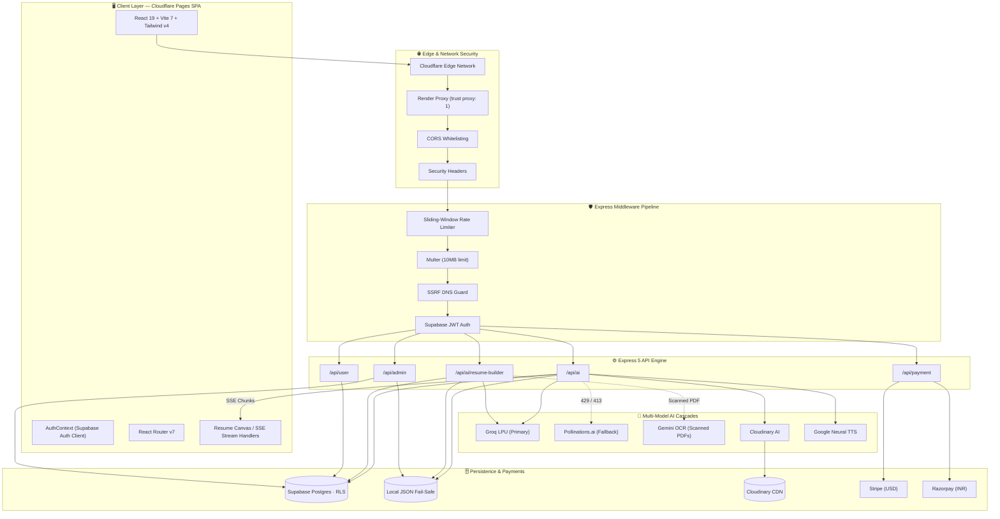

<details>
<summary><b>🔁 Knowledge flow — how a doubt/query gets answered (sequence diagram)</b></summary>

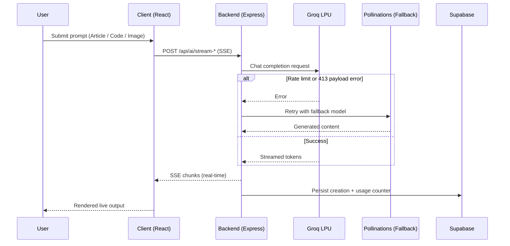

</details>

---

## 💻 Full Tech Stack

<details open>
<summary><b>🎨 Frontend — <code>client/</code></b></summary>

| Package | Version | Purpose |
|---|---|---|
| `react` | `^19.1.0` | Core declarative UI library |
| `react-dom` | `^19.1.0` | DOM rendering & reconciliation |
| `react-router-dom` | `^7.6.3` | Client-side routing & protected layouts |
| `@supabase/supabase-js` | `^2.116.0` | Auth, sessions, database access |
| `tailwindcss` | `^4.1.11` | Utility-first styling |
| `@tailwindcss/vite` | `^4.1.11` | Tailwind Vite compiler plugin |
| `axios` | `^1.10.0` | HTTP client & file uploads |
| `lucide-react` | `^0.525.0` | SVG iconography |
| `mermaid` | `^12.0.0` | Client-side flowchart/mindmap rendering |
| `react-markdown` + `remark-gfm` | `^10.1.0` / `^4.0.1` | GFM Markdown rendering |
| `docx` | `^9.7.1` | Word document export |
| `react-hot-toast` | `^2.5.2` | Toast notifications |
| `sweetalert2` | `^11.22.3` | Confirmation dialogs |
| `sucrase` | `^3.35.1` | In-browser JSX/TS transpilation |
| `vite` *(dev)* | `^7.0.0` | Build tool & dev server |
| `@vitejs/plugin-react` *(dev)* | `^4.5.2` | Fast Refresh + Babel |
| `eslint` + plugins *(dev)* | `^9.29.0` | Linting |
| `@types/react`, `@types/react-dom` *(dev)* | `^19.1.x` | TS type declarations |
| `globals` *(dev)* | `^16.2.0` | ESLint global definitions |

</details>

<details open>
<summary><b>⚙️ Backend — <code>server/</code></b></summary>

| Package | Version | Purpose |
|---|---|---|
| `express` | `^5.1.0` | HTTP web framework |
| `@supabase/supabase-js` | `^2.116.0` | Admin SDK — JWT validation, RLS bypass |
| `openai` | `^5.8.2` | SDK configured for Groq & Gemini endpoints |
| `cloudinary` | `^2.7.0` | Media hosting, BG removal, inpainting |
| `stripe` | `^22.6.2` | USD subscriptions & webhooks |
| `razorpay` | `^2.9.8` | INR orders & signature verification |
| `multer` | `^2.0.1` | Multipart file upload handling |
| `pdf-parse` | `^1.1.1` | PDF text extraction |
| `mammoth` | `^1.12.3` | DOCX text extraction |
| `cheerio` | `^1.2.0` | Server-side HTML scraping |
| `youtube-transcript` | `^1.3.1` | YouTube caption fetching |
| `axios` | `^1.10.0` | External API calls, SSRF-validated fetch |
| `cors` | `^2.8.5` | CORS with origin whitelist |
| `dotenv` | `^17.0.1` | Environment variable loading |
| `ws` | `^8.21.3` | WebSocket polyfill for Supabase Realtime |
| `nodemon` *(dev)* | `^3.1.10` | Auto-restart dev monitor |

</details>

---

## 📂 Project Directory Structure

<details>
<summary><b>📁 Click to expand the full file tree</b></summary>

```text
Visionary AI/
├── client/                               # Frontend Single Page Application
│   ├── public/                           # Static assets, icons, manifest
│   ├── src/
│   │   ├── assets/                       # SVGs, illustrations, logos
│   │   ├── components/                   # Reusable UI modules
│   │   │   ├── admin/                    # Admin-specific widgets
│   │   │   ├── AdminRoute.jsx
│   │   │   ├── AiTools.jsx
│   │   │   ├── ArticleOutlineBuilder.jsx
│   │   │   ├── AudioBriefingPlayer.jsx
│   │   │   ├── AuthModal.jsx
│   │   │   ├── CommandPalette.jsx
│   │   │   ├── ComparisonSlider.jsx
│   │   │   ├── ContentRepurposerModal.jsx
│   │   │   ├── CreationItem.jsx
│   │   │   ├── InlineCopilotToolbar.jsx
│   │   │   ├── MarkdownRenderer.jsx
│   │   │   ├── Navbar.jsx
│   │   │   ├── Plan.jsx
│   │   │   ├── ResumeLiveCanvas.jsx
│   │   │   ├── Sidebar.jsx
│   │   │   ├── SummaryChatDrawer.jsx
│   │   │   └── VisualMindmapViewer.jsx
│   │   ├── configs/                      # pricing.js · supabase.js
│   │   ├── context/AuthContext.jsx
│   │   ├── hooks/usePWA.js
│   │   ├── pages/                        # Route-level views
│   │   │   ├── admin/AdminDashboard.jsx
│   │   │   ├── Community.jsx
│   │   │   ├── Dashboard.jsx
│   │   │   ├── GenerateImages.jsx
│   │   │   ├── Home.jsx
│   │   │   ├── Layout.jsx
│   │   │   ├── MyCreations.jsx
│   │   │   ├── PhotoCleanup.jsx
│   │   │   ├── ProfileSettings.jsx
│   │   │   ├── PublicShare.jsx
│   │   │   ├── QuickCode.jsx
│   │   │   ├── ResumeBuilder.jsx
│   │   │   ├── ReviewResume.jsx
│   │   │   ├── SummarizeArticle.jsx
│   │   │   └── WriteArticle.jsx
│   │   ├── services/api.js, streamService.js
│   │   ├── utils/pdfFormatter.js, resumePdfFormatter.js, seoAnalyzer.js
│   │   ├── App.jsx · index.css · main.jsx
│   ├── eslint.config.js · index.html · vercel.json · vite.config.js
│
├── server/                               # Backend Express API Engine
│   ├── configs/cloudinary.js, db.js, multer.js, supabase.js
│   ├── controllers/
│   │   ├── adminController.js
│   │   ├── aiController.js
│   │   ├── paymentController.js
│   │   ├── resumeBuilderController.js
│   │   └── userController.js
│   ├── data/creations.json, resumes.json   # Local fail-safe store
│   ├── middlewares/adminAuth.js, auth.js, rateLimiter.js
│   ├── routes/adminRoutes.js, aiRoutes.js, paymentRoutes.js, userRoutes.js
│   ├── services/creationService.js, pdfExtractorService.js, resumeService.js
│   ├── nodemon.json · package.json · server.js · vercel.json
│
├── render.yaml                           # Render IaC spec
├── supabase-schema.sql                   # Postgres schema + RLS rules
└── README.md
```

</details>

---

## 🗄️ Database Schema & Storage Architecture

Visionary.ai runs on **Supabase PostgreSQL**, secured with **Row Level Security (RLS)**, backed by a zero-latency local JSON fallback (`creations.json`, `resumes.json`) so the platform stays online during database maintenance.

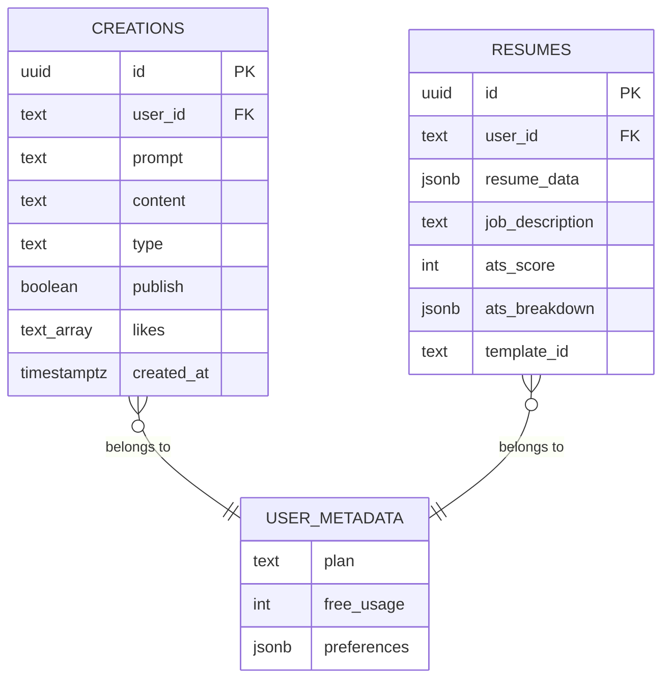

<details>
<summary><b>🧾 Full SQL schema (<code>supabase-schema.sql</code>)</b></summary>

```sql
-- ==============================================================================
-- Visionary.ai — Supabase Database Schema
-- Run this in Supabase Dashboard → SQL Editor (New Query) → Run
-- ==============================================================================

CREATE TABLE IF NOT EXISTS public.creations (
    id UUID PRIMARY KEY DEFAULT gen_random_uuid(),
    user_id TEXT NOT NULL,
    prompt TEXT NOT NULL,
    content TEXT NOT NULL,
    type TEXT NOT NULL, -- 'article' | 'summary' | 'quick-code' | 'image' | 'resume-review'
    publish BOOLEAN DEFAULT FALSE,
    likes TEXT[] DEFAULT '{}',
    created_at TIMESTAMPTZ DEFAULT NOW()
);

CREATE INDEX IF NOT EXISTS idx_creations_user_id ON public.creations(user_id);
CREATE INDEX IF NOT EXISTS idx_creations_publish ON public.creations(publish);
CREATE INDEX IF NOT EXISTS idx_creations_created_at ON public.creations(created_at DESC);
CREATE INDEX IF NOT EXISTS idx_creations_type ON public.creations(type);

ALTER TABLE public.creations ENABLE ROW LEVEL SECURITY;

DROP POLICY IF EXISTS "Anyone can view published creations" ON public.creations;
CREATE POLICY "Anyone can view published creations"
    ON public.creations FOR SELECT USING (publish = true);

DROP POLICY IF EXISTS "Users can view their own creations" ON public.creations;
CREATE POLICY "Users can view their own creations"
    ON public.creations FOR SELECT USING (auth.uid()::text = user_id);

DROP POLICY IF EXISTS "Users can insert own creations" ON public.creations;
CREATE POLICY "Users can insert own creations"
    ON public.creations FOR INSERT WITH CHECK (auth.uid()::text = user_id);

DROP POLICY IF EXISTS "Users can update their creations" ON public.creations;
CREATE POLICY "Users can update their creations"
    ON public.creations FOR UPDATE USING (auth.uid()::text = user_id) WITH CHECK (auth.uid()::text = user_id);

DROP POLICY IF EXISTS "Users can delete own creations" ON public.creations;
CREATE POLICY "Users can delete own creations"
    ON public.creations FOR DELETE USING (auth.uid()::text = user_id);
```

</details>

**Table notes:**
- **`creations`** — every generated asset (article/summary/code/image/resume-review), gated by RLS so users only see their own rows plus anything published.
- **`resumes`** (runtime upsert) — candidate resume versions, job descriptions, ATS score breakdowns, template selection.
- **`auth.users.user_metadata`** — instead of a separate users table, plan (`free`/`premium`), `free_usage` counter, and tool preferences live directly on the Supabase Auth user.

---

## 📡 API Documentation

<details>
<summary><b>🤖 AI Creative & Streaming — <code>/api/ai</code></b></summary>

| Method | Endpoint | Auth | Description |
|---|---|---|---|
| GET/POST | `/tts-stream` | Optional | Streams natural TTS audio (auto EN/HI) |
| POST | `/extract-document-content` | Optional | Extracts text from uploaded docs (≤10MB) |
| POST | `/generate-article` | Required | Synchronous Markdown article generation |
| POST | `/generate-outline` | Optional | Structured multi-section article outline |
| POST | `/generate-article-cover` | Optional | 16:9 editorial cover image via Cloudinary |
| POST | `/repurpose-article` | Optional | Twitter thread / LinkedIn post / newsletter |
| POST | `/copilot-rewrite` | Optional | Inline shorten / analogy / persuasive / Hindi / expand |
| POST | `/extract-source-content` | Optional | Web (SSRF-safe) or YouTube transcript extraction |
| POST | `/generate-summary-mindmap` | Optional | Mermaid.js flowchart from summary |
| POST | `/chat-summary` | Optional | Context-grounded Q&A |
| POST | `/summarize-article` | Required | Text compression by 1–99% |
| POST | `/generate-quick-code` | Required | Code + Big-O complexity header |
| POST | `/stream-article` \| `/stream-summary` \| `/stream-quick-code` | Required | SSE real-time token streams |
| POST | `/generate-image` | Required | 4K multi-model image generation |
| POST | `/enhance-image-prompt` | Required | Prompt enrichment (lighting/lens/style) |
| POST | `/remove-image-background` | Required | Cloudinary AI background removal |
| POST | `/remove-image-object` | Required | Generative object inpainting |
| POST | `/resume-review` | **Pro** | ATS rubric scoring + Gemini OCR fallback |
| POST | `/optimize-resume-bullet` | **Pro** | Google XYZ bullet optimizer |
| POST | `/generate-cover-letter` | **Pro** | Tailored 4-paragraph cover letter |
| POST | `/execute-code` | Required | Multi-language sandbox execution |

</details>

<details>
<summary><b>📝 Resume Builder Studio — <code>/api/ai/resume-builder</code></b></summary>

| Method | Endpoint | Auth | Description |
|---|---|---|---|
| POST | `/parse` | Optional | Resume → structured JSON |
| POST | `/analyze-jd` | Optional | Job description → key competencies |
| POST | `/smart-followup` | Optional | AI-generated probing interview questions |
| POST | `/synthesize` | Optional | Full ATS-tailored resume synthesis |
| POST | `/improve-section` | Optional | Targeted section refinement |
| GET | `/list` | Required | List saved resume versions |
| GET | `/:id` | Required | Fetch resume by ID |
| POST | `/save` | Required | Save/update resume version |
| POST | `/auto-fix-audit` | Optional | Auto-fix passive verbs / missing metrics |
| DELETE | `/:id` | Required | Delete resume version |

</details>

<details>
<summary><b>👤 User & Community — <code>/api/user</code></b></summary>

| Method | Endpoint | Auth | Description |
|---|---|---|---|
| GET | `/platform-stats` | Public | Marketing-page usage metrics |
| GET | `/get-user-creations` | Required | Private creation history |
| GET | `/get-published-creations` | Optional | Public community feed |
| GET | `/get-creation/:id` | Public | Single creation preview |
| POST | `/toggle-like-creation` | Required | Like/unlike |
| DELETE | `/delete-creation/:id` | Required | Delete (ownership-checked) |
| GET | `/profile` | Required | Profile, plan, quota usage |
| POST | `/update-profile` | Required | Update profile + avatar upload |
| POST | `/update-preferences` | Required | Save tool defaults |
| POST | `/upgrade-plan` | Required | Upgrade/downgrade via promo code |

</details>

<details>
<summary><b>💳 Payments — <code>/api/payment</code></b></summary>

| Method | Endpoint | Auth | Description |
|---|---|---|---|
| GET | `/config` | Public | Active gateway config & public keys |
| POST | `/stripe/create-session` | Required | USD checkout session |
| POST | `/stripe/verify-payment` | Required | Confirm & upgrade plan |
| POST | `/stripe/webhook` | Stripe Sig | `checkout.session.completed` listener |
| POST | `/razorpay/create-order` | Required | INR order creation |
| POST | `/razorpay/verify-payment` | Required | HMAC signature verification |
| POST | `/razorpay/webhook` | Razorpay Sig | `payment.captured` / `order.paid` |

</details>

<details>
<summary><b>🛠️ Admin Control Center — <code>/api/admin</code></b></summary>

| Method | Endpoint | Auth | Description |
|---|---|---|---|
| GET | `/status` | Admin | Verify admin identity |
| GET | `/overview` | Admin | MRR, token telemetry, system health |
| GET | `/users` | Admin | Paginated user directory |
| POST | `/update-user-plan` | Admin | Manual plan/quota override |
| GET | `/creations` | Admin | All platform creations |
| POST | `/toggle-publish` | Admin | Toggle community visibility |
| DELETE | `/delete-creation/:creationId` | Admin | Admin deletion |

</details>

<details>
<summary><b>💚 Health & Diagnostics</b></summary>

| Method | Endpoint | Description |
|---|---|---|
| GET | `/` | API root status |
| GET | `/health` | Uptime/health check for Render |

</details>

---

## 🔐 Environment Variables

<details>
<summary><b>🎨 Client — <code>client/.env</code></b></summary>

| Variable | Required | Purpose |
|---|:---:|---|
| `VITE_BASE_URL` | ✅ | Backend API base URL |
| `VITE_SUPABASE_URL` | ✅ | Supabase project URL |
| `VITE_SUPABASE_ANON_KEY` | ✅ | Supabase public anon key |
| `VITE_RAZORPAY_KEY_ID` | ⚪ | Razorpay public key for checkout |

</details>

<details>
<summary><b>⚙️ Server — <code>server/.env</code></b></summary>

| Variable | Required | Purpose |
|---|:---:|---|
| `PORT` | ⚪ | Server port (default 3000) |
| `ALLOWED_ORIGINS` | ⚪ | CORS whitelist |
| `SUPABASE_URL` | ✅ | Supabase project URL |
| `SUPABASE_ANON_KEY` | ⚪ | Fallback public key |
| `SUPABASE_SERVICE_ROLE_KEY` | ✅ | Bypasses RLS, manages auth users |
| `GROQ_API_KEY` | ✅ | Groq LPU inference |
| `GROQ_MODEL` | ⚪ | Primary model (default `groq/compound`) |
| `GEMINI_API_KEY` | ⚪ | Multimodal OCR fallback |
| `POLLINATIONS_API_KEY` | ⚪ | Image generation fallback |
| `CLOUDINARY_CLOUD_NAME` | ✅ | Cloudinary account |
| `CLOUDINARY_API_KEY` | ✅ | Cloudinary API key |
| `CLOUDINARY_API_SECRET` | ✅ | Cloudinary API secret |
| `ADMIN_EMAILS` | ⚪ | Authorized admin email |
| `VIP_PROMO_CODE` | ⚪ | Secret Pro upgrade code |
| `STRIPE_SECRET_KEY` / `STRIPE_PUBLISHABLE_KEY` | ⚪ | Stripe checkout |
| `STRIPE_WEBHOOK_SECRET` | ⚪ | Verify Stripe events |
| `STRIPE_SUCCESS_URL` / `STRIPE_CANCEL_URL` | ⚪ | Post-checkout redirects |
| `RAZORPAY_KEY_ID` / `RAZORPAY_KEY_SECRET` | ⚪ | Razorpay orders |
| `RAZORPAY_WEBHOOK_SECRET` | ⚪ | Verify Razorpay events |

> [!WARNING]
> Never commit real keys. `.env` files are already git-ignored — always copy from `.env.example` and fill in locally or in your hosting provider's secret manager.

</details>

---

## 🚀 Installation & Local Setup

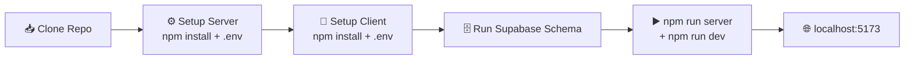

**Prerequisites:** Node.js `v20+`, npm `v10+`, Git

```bash
# 1. Clone
git clone https://github.com/Aniket-Meshram-dev/Visionary-AI.git
cd Visionary-AI

# 2. Backend
cd server
npm install
cp .env.example .env    # fill in SUPABASE_*, GROQ_API_KEY, CLOUDINARY_*
npm run server          # → http://localhost:3000

# 3. Frontend (new terminal)
cd client
npm install
cp .env.example .env    # fill in VITE_BASE_URL, VITE_SUPABASE_*
npm run dev              # → http://localhost:5173
```

**4. Initialize the database** — open your Supabase project's SQL Editor, paste [`supabase-schema.sql`](./supabase-schema.sql), and click **Run**.

---

## 🚢 Deployment Guide

<table>
<tr>
<td width="50%" valign="top">

### ☁️ Frontend — Cloudflare Pages
1. Connect the GitHub repo
2. Framework: `Vite` · Root: `client`
3. Build: `npm run build` · Output: `dist`
4. Add `VITE_*` env vars
5. Deploy → auto CDN URL

</td>
<td width="50%" valign="top">

### 🖥️ Backend — Render
1. New → Blueprint → select repo
2. Auto-parses [`render.yaml`](./render.yaml)
3. Root: `server` · Start: `npm start`
4. Health check: `/health`
5. Add secrets → auto-deploy on push to `main`

</td>
</tr>
</table>

---

## 🛡️ Security & Access Control

- 🔑 **JWT Auth** — every protected route validates the Supabase Bearer token via `supabaseAdmin.auth.getUser()`.
- 👑 **Single-Admin Gate** — `/api/admin/*` requires `user.email === 'admin@gmail.com'` even with a valid token; unauthorized calls return `403`.
- 🎟️ **Plan Gating** — Free tier: 10 generations tracked in `user_metadata.free_usage`; Pro: unlimited + exclusive ATS tools.
- 🌐 **SSRF Defense** — DNS pre-resolution (`dns.promises.lookup`) blocks loopback, private-range, and cloud-metadata IPs before any outbound fetch.
- 📁 **Upload Hardening** — Multer, 10MB cap, strict extension whitelist, executable formats rejected, temp files wiped post-extraction.
- ⏱️ **Rate Limiting** — sliding-window limiter: 120 req/15min on AI routes, 60 req/5min on admin routes.
- 🧱 **Security Headers** — `trust proxy`, `X-Content-Type-Options`, `X-Frame-Options`, `X-XSS-Protection`.

---

## 🧠 Challenges Faced & Engineering Learnings

<details>
<summary><b>1. Self-healing LLM rate limits & 413 payload breaches</b></summary>

Long articles/transcripts routinely blew past Groq's free-tier token quotas (HTTP 413). Built a self-healing wrapper (`runChatCompletion` / `runChatStreaming`) that truncates payloads, halves `max_tokens`, and fails over through a priority model chain before falling back to Pollinations AI.
</details>

<details>
<summary><b>2. Dual-engine PDF extraction for vector & scanned resumes</b></summary>

`pdf-parse` fails on Canva/Figma-exported resumes where text is vectorized. Built a hybrid extractor that tries fast in-memory parsing first, then automatically escalates to Gemini multimodal OCR when extracted text is negligible (&lt;30 chars).
</details>

<details>
<summary><b>3. SSRF network defense for URL summarization</b></summary>

Letting users submit arbitrary URLs opened an SSRF risk (internal IPs, cloud metadata endpoints). Added async DNS pre-flight validation rejecting loopback/private/link-local ranges before Axios ever connects.
</details>

<details>
<summary><b>4. Resilient SSE with client abort signaling</b></summary>

Users navigating away mid-generation left dangling LLM streams consuming server resources. Wired `AbortController` + `req.on('close')` to cancel upstream inference the moment the client disconnects.
</details>

<details>
<summary><b>5. Dual-currency payment synchronization</b></summary>

Supporting Stripe (USD, cents) and Razorpay (INR, paise) meant two different webhook schemes and signature flows. Unified them into one payment controller handling currency conversion, HMAC verification, and atomic plan upgrades in Supabase metadata.
</details>

---

## 🔮 Future Improvements & Roadmap

- [ ] 🤝 Collaborative multi-user workspaces with shared credits & RBAC
- [ ] 📤 Native OAuth publishing to Twitter/X and LinkedIn
- [ ] 🎙️ Voice-to-voice AI interview simulator
- [ ] 🧠 `pgvector`-powered RAG knowledge base for private document chat
- [ ] 🎨 More resume canvas themes, fonts, and color palettes

---

## 👤 Author & Contact

<div align="center">

### Aniket Meshram

[](https://github.com/Aniket-Meshram-dev)
[](https://www.linkedin.com/in/aniket-meshram-dev/)
[](mailto:aniketmeshram445@gmail.com)

</div>

---

## 📄 License

Licensed under the **MIT License** — see [LICENSE](./LICENSE) for details.

<div align="center">

### ⭐ If this project helped you, consider giving it a star!

</div>
